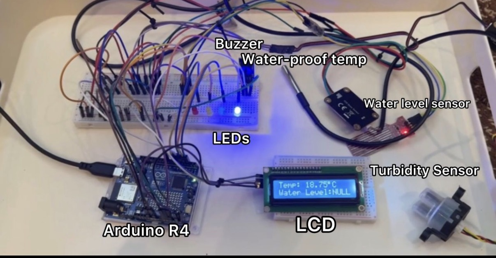
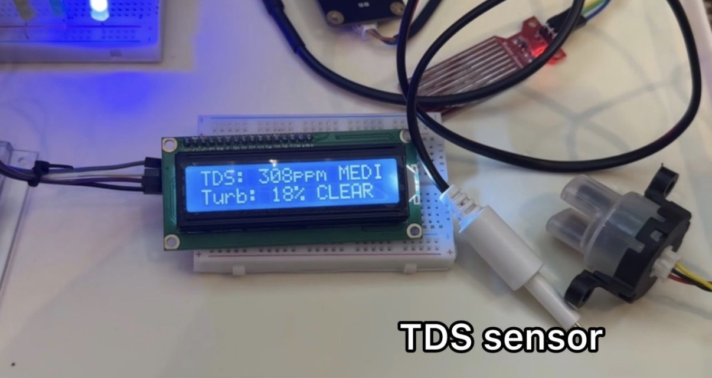

# Water Quality Monitoring System

An Arduino-based water quality monitoring system designed and implemented to measure TDS, turbidity, temperature, and water level in real time.

The system processes sensor readings, displays the results locally on an LCD, provides LED and buzzer alerts, and sends the measurements to the Arduino IoT Cloud for remote monitoring.

## System Overview



The system integrates multiple sensors with an Arduino UNO R4 WiFi to continuously monitor different water conditions.

The main components include:

- Arduino UNO R4 WiFi
- TDS sensor
- Turbidity sensor
- Waterproof temperature sensor
- Water level sensor
- I2C LCD display
- LED indicators
- Buzzer

## Features

- Real-time TDS measurement
- Turbidity measurement and classification
- Water temperature monitoring
- Water level detection
- LCD display for local monitoring
- LED status indicators
- Buzzer warning system
- Arduino IoT Cloud integration
- Sensor filtering and averaging
- Temperature compensation for TDS readings

## Hardware Prototype


The prototype combines the sensors, Arduino board, LCD, LEDs, and buzzer into a single embedded monitoring system.

The Arduino continuously collects measurements from the sensors, processes them, displays the readings locally, and sends the data to the IoT dashboard.

## LCD Output



The LCD provides real-time feedback directly from the system.

The display alternates between two screens every three seconds.

### Screen 1

Displays:

- TDS value
- TDS classification
- Turbidity percentage
- Turbidity classification

### Screen 2

Displays:

- Water temperature
- Water level

This allows multiple measurements to be displayed using the same LCD.

## Sensor Measurements

The system monitors four main water parameters.

### TDS

The TDS sensor measures Total Dissolved Solids in the water.

Instead of relying on a single analog reading, the system collects multiple ADC samples. The samples are sorted, extreme values are removed, and the remaining values are averaged.

Temperature compensation is then applied before calculating the final TDS value.

The TDS reading is classified as:

- LOW
- MEDIUM
- HIGH

### Turbidity

The turbidity sensor measures water clarity using an analog signal.

The reading is converted into a percentage and classified as:

- CLEAR
- CLOUDY
- DIRTY

### Temperature

A waterproof DS18B20 temperature sensor measures water temperature in degrees Celsius.

The measured temperature is also used to compensate the TDS calculation.

### Water Level

The water level sensor detects the amount of water present and classifies it as:

- LOW
- MEDIUM
- HIGH
- No water

## Sensor Setup


The system uses separate sensors for different water measurements.

The TDS sensor measures dissolved solids, the turbidity sensor measures water clarity, the waterproof temperature probe measures temperature, and the water-level sensor detects the amount of water present.

## Circuit and Hardware Integration


One of the main parts of the project was integrating several sensors and outputs into one system.

Each sensor has different reading and processing requirements. The Arduino manages these measurements while also controlling the LCD, LEDs, buzzer, and IoT Cloud connection.

## Arduino IoT Cloud


The system is connected to the Arduino IoT Cloud through the Arduino UNO R4 WiFi.

The dashboard allows the sensor information to be monitored remotely.

The monitored values include:

- Turbidity
- TDS
- Temperature
- Water level

This provides both local monitoring through the LCD and remote monitoring through the IoT dashboard.

## Pin Configuration

| Component | Arduino Pin |
|---|---|
| Temperature Sensor | D5 |
| TDS Sensor | A1 |
| Turbidity Sensor | A0 |
| Water Level Sensor | A2 |
| High Water Level LED | D2 |
| Medium Water Level LED | D3 |
| Low Water Level LED | D4 |
| No Water LED | D6 |
| Buzzer | D8 |
| LCD | I2C |

## Data Filtering

Analog sensor readings can fluctuate because of electrical noise and sensor instability.

To improve the stability of the TDS measurement, the system:

1. Collects 10 ADC samples.
2. Sorts the readings.
3. Removes the two highest readings.
4. Removes the two lowest readings.
5. Averages the remaining six readings.
6. Converts the averaged ADC value into voltage.
7. Applies temperature compensation.
8. Calculates the final TDS value.

This helps reduce the effect of unusually high or low sensor readings.

## Warning System

The system includes a buzzer to warn the user when abnormal readings are detected.

A warning is triggered when:

- TDS reaches 400 ppm or higher.
- Turbidity reaches 50% or higher.

The buzzer produces two short beeps followed by one longer beep.

A cooldown period prevents the warning sound from repeating continuously.

## LED Indicators

Four LEDs provide a visual indication of the detected water level.

| Water Level | Indicator |
|---|---|
| HIGH | Green LED |
| MEDIUM | Yellow LED |
| LOW | Red LED |
| No Water | Blue LED |

Only the LED corresponding to the current water-level condition is activated.

## Software

The project was programmed using Arduino C++.

The main libraries used are:

```cpp
#include "thingProperties.h"
#include <OneWire.h>
#include <DallasTemperature.h>
#include <LiquidCrystal_I2C.h>
